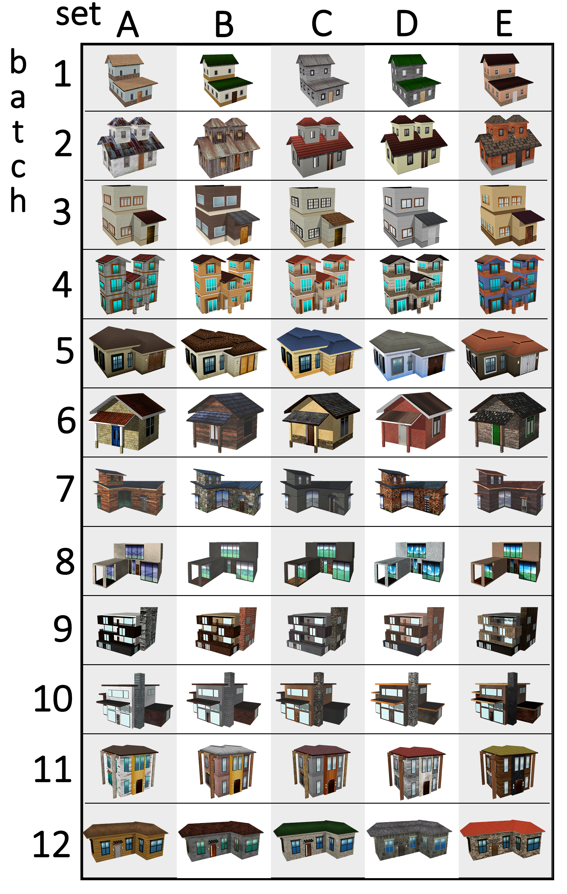

# Scan-RL: Next-Best View Policy for 3D Reconstruction
This is the release code of Scan-RL and of Houses3K dataset presented in the paper Next-Best View Policy for 3D Reconstruction.

## Houses3K
Houses3K is a dataset of 3000 textured 3D house models.

- Raw Houses3K Dataset can be found [here](https://drive.google.com/drive/folders/1lbuzOsz3DIJVVAzvuT-KzDs3pVzGWPwx?usp=sharing).
- Houses3K sampled data used as groundtruth can be found [here](https://drive.google.com/drive/folders/1dP5V0NBHbr3eGz0av6xohEK9kZL5sVoI?usp=sharing).

## Scan-RL
### Diagram

### Implementation
The RL implementation was based on this [repo](https://github.com/germain-hug/Deep-RL-Keras).
Gym environments are based on UnrealCV and [gym-unrealcv](https://github.com/darylperalta/gym-unrealcv).

- To install the environments, you need to install this fork of [gym-unrealcv](https://github.com/darylperalta/gym-unrealcv).
- Unreal Environments can be found [here]( https://drive.google.com/drive/folders/12Mo7vrlws0mcU99q-U7CzECoLLO50iUh?usp=sharing)
- Some weights can be found here:
    - Single House Experiment [weights](https://drive.google.com/drive/folders/1Rd7VJHZIQB3rn-XL35MR7E7UrK_3vlg_?usp=sharing)
    - Multiple Houses New Split [weights](https://drive.google.com/drive/folders/1N5ixPHbSHh_SUTj3GMEFMRUHL4JQFKLu?usp=sharing)
    - Stanford Bunny Experiment [weights](https://drive.google.com/drive/folders/1WnsleXGK0S0KcC0XMzYb6Ddw4LCBHPTb?usp=sharing)

- Comands to run the code can be found in commands.txt
