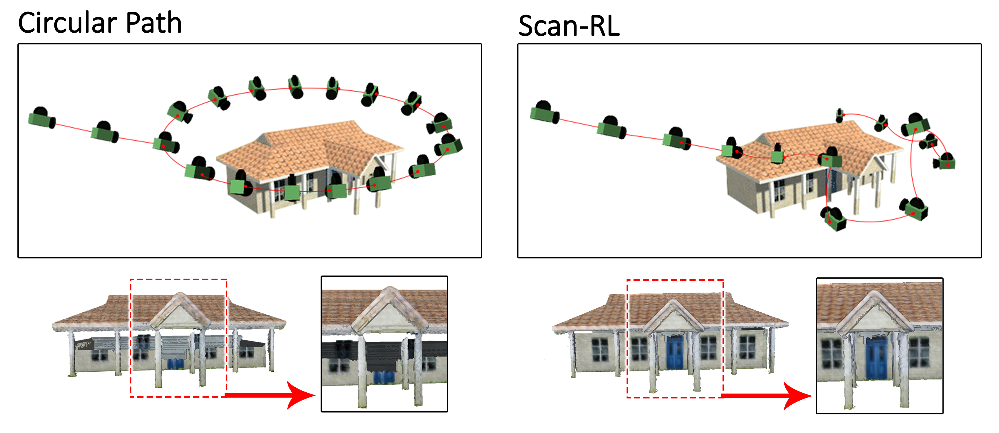
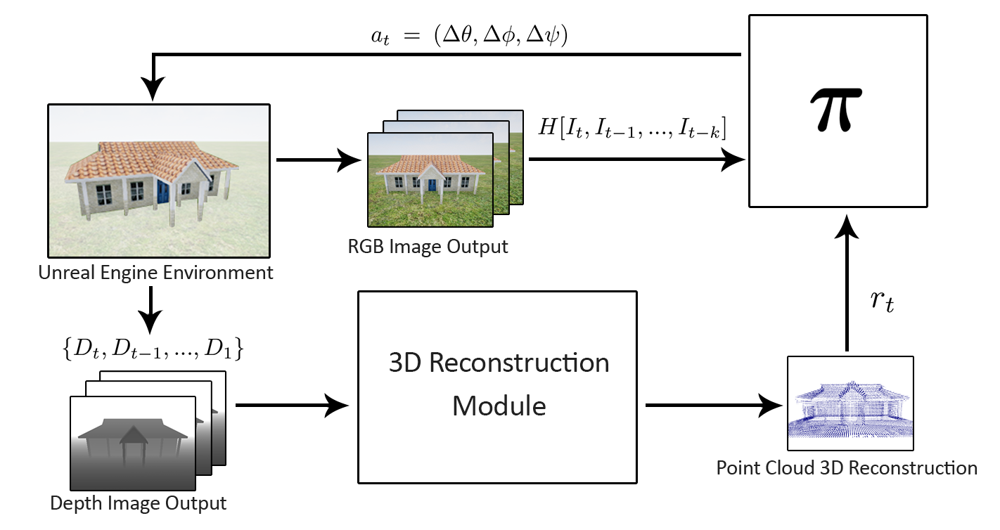

# Scan-RL: Next-Best View Policy for 3D Reconstruction

[Next-Best View Policy for 3D Reconstruction](http://arxiv.org/abs/2008.12664) to be presented at [2020 ECCV Wokshop](http://uavisionvisdrone.com/#/index/home).

*Peralta, D., Casimiro, J., Nilles, A.M., Aguilar, J.A., Atienza, R., and Cajote, R. "Next-Best View Policy for 3D Reconstruction." European Conference on Computer Vision (ECCV) Workshops, 2020.*

**Scan-RL**  code implementation from the paper *Next-Best View Policy for 3D Reconstruction*. The **Houses3K** dataset used in this paper can be found in this [link](https://github.com/darylperalta/Houses3K).




## Scan-RL
### Diagram


## Setting up the Environment
- Necessary Python packages can be found in [python_requirements.txt](python_requirements.txt).
- To install the environments, you need to install our fork of [gym-unrealcv](https://github.com/darylperalta/gym-unrealcv). Additional instructions are included there.


### Single House Policy Experiment

- [Weights](https://drive.google.com/drive/folders/1Kw06HFt7yXoWE8vYw48GITTr7CcADA96?usp=sharing)
- Circular baseline script can be found [here](https://github.com/darylperalta/gym-unrealcv/blob/v0.2/example/circular_agent/circular_agent_close_depth.py).
- Sample Usage

Training *(Discrete Action Space)*

```
python main_unreal.py --nb_episodes 500 --batch_size 32 --epsilon_decay 0.999 --epsilon 1.0 --save_interval 20 --consecutive_frames 3 --type DDQN --env DepthFusionBGray-v0
 ```

Training *(Continuous Action Space)*

```
python main_unreal.py --nb_episodes 500 --batch_size 32 --epsilon_decay 0.999 --epsilon 1.0 --save_interval 20 --consecutive_frames 6 --type DDPG --env DepthFusionBGrayContinuous-v0
```

Testing
```
python load_and_run_unreal.py --type DDQN --consecutive_frames 6 --model_path '/hdd/AIRSCAN/sfm_results/RL_VP/new_baselines/bat6/2dist_45az_3elev/models/DDQN_ENV_DepthFusionBGray-v0_NB_EP_1000_BS_32_LR_0.00025_ep_10000.h5' --epsilon 0.0
```

### Multiple Houses Policy Experiment (Geometry Split)
- [Weights](https://drive.google.com/drive/folders/1K25riPR77HgloM9xTUDtYBHTJKzxoDjC?usp=sharing)
- Circular baseline script can be found [here](https://github.com/darylperalta/gym-unrealcv/blob/v0.2/example/circular_agent/circular_agent_baseline.py).
- Sample Usage

Training

```
python main_unreal.py --nb_episodes 2500 --batch_size 10 --epsilon_decay 0.999 --epsilon 1.0 --save_interval 20 --consecutive_frames 6 --type DDQN --env DepthFusionBGrayMultHouseRand-v0
```

Testing

```
python main_unreal.py --nb_episodes 2500 --batch_size 10 --epsilon_decay 0.999 --epsilon 1.0 --save_interval 20 --consecutive_frames 6 --type DDQN --env DepthFusionBGrayMultHouseRand-v0

```

### Non-House Target Model (Stanford Bunny) Experiment
- [Weights](https://drive.google.com/drive/folders/1L0zjXO_w-bRLNeLa6nXTZhNkItc3V2un?usp=sharing)
- Sample Usage

```
python load_and_run_unreal.py --model_path '/home/daryl/gym-unrealcv/new_bunny_3pen_89cov/models/DDQN_ENV_Bunny-v0_NB_EP_1000_BS_32_LR_0.00025_ep_10000.h5' --consecutive_frames 6 --type DDQN --env Bunny-v0 --epsilon 0.0

```

## Citation


### References
The RL implementation was based on this [repo](https://github.com/germain-hug/Deep-RL-Keras).
Gym environments are based on UnrealCV and [gym-unrealcv](https://github.com/darylperalta/gym-unrealcv).
